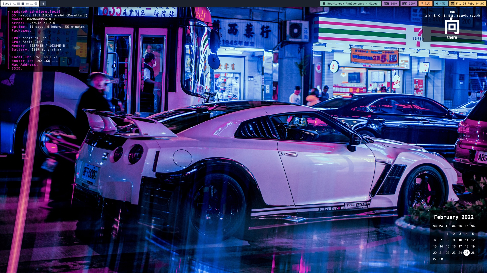

### Hey, it's chardskarth! 👋

I'm a coffee fueled, software engineer currenly working at [White Cloak Technologies Inc.](https://www.whitecloak.com/) as an Engineering Manager. 

As of the moment, I'm buried deep under the rabbit hole of [ricing](https://www.reddit.com/r/unixporn/), all the while trying to keep living a normal life.  
And besides burying myself deeper in this hole I'm in, I [don't](https://soundcloud.com/chardmusic) [have](https://www.youtube.com/watch?v=E8wsI0cSTkc&ab_channel=R) [much other](https://www.youtube.com/watch?v=zrh5L2v5OeE&ab_channel=R) hobbies. [趣味はあまりない](https://www.duolingo.com/profile/Leechado?via=share_profile)

With my goal of giving back to the open source community, I aim to:
- [ ] Create [my blog](https://triumphsc.org/wp-content/uploads/2019/03/construction-web-.jpg) to write and share about things I've learned in software development (and in life), so far.
- [ ] Maintain my [dotfiles repository](https://github.com/chardskarth/dotfiles) to not let you fall deep like where I am right now.
- [ ] Donate! There's a lot in open source to be thankful for, gahh.

---
Oh, here's my ricing progress so far:

---
Just reach out there's anything I can help you with.

That's all for now, see you around. 🖖
